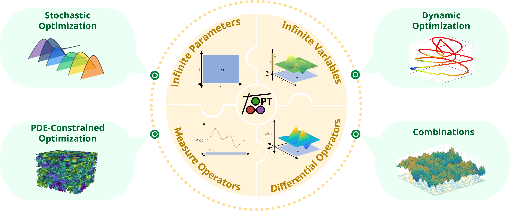

# Four-Hour InfiniteOpt Workshop
This is a crash course into using Julia, JuMP, and InfiniteOpt.

The course is driven by `slides.pdf` and is comprised of three hands-on Jupyter notebook modules:
 - 
Part 1: Julia overview.  
 - 
Part 2: JuMP overview.  
 - 
Part 3: InfiniteOpt overview.  

When you open each notebook in Colab, to run Julia, you'll need to click on `Runtime` > `Change runtime type` to open the Change runtime type window. Then under `Runtime type`, select `Julia` from the dropdown menu and click on `save` at the bottom of the window.